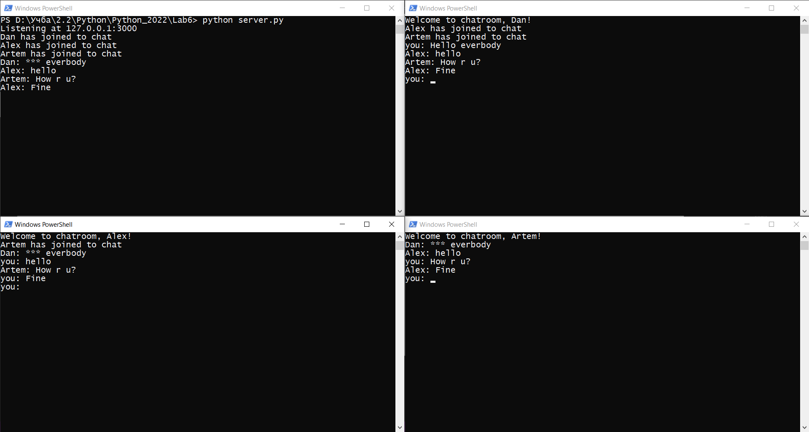

# Dan-Frych | Variant 30 | Python | 2022

* ### [Lab 6 - Chatroom](Resources/Lab6.png)

Детальніше

    Створити чат-застосунок з фільтрацією певних слів, зазначених в текстовому файлі на стороні серверу. Сервер повинен підтримувати одночасно 10 з’єднань

### Результат:

* ### [Lab 7 - Flask](Resources/Lab7.png)

Детальніше

   Створити застосунок з використанням мікрофреймворку Flask, який буде містити два роути:
    1.	Кореневий роут ('/') в якому буде виводитися час на момент запиту
    2.	Роут ('/<cityname>') в якому буде виводитися часовий пояс міста.

### Результат:

.png)

.png)

* ### [Lab 8 - Flask Bootstrap](Resources/Lab8.png)

Детальніше

    Створіть веб-застосунок з використанням Flask та Flask-Bootstrap, який буде мати декілька сторінок та одну веб-форму. Головна сторінка повинна містити посилання на інші сторінки та веб-форму застосунку, а також виводити ваше прізвище, ім'я та номер групи. Вміст інших сторінок та веб-форми має бути в залежності від варіанту. Варіанти розподілені за списком вашої групи.

    app.route('/Currency') - сторінка має містити таблицю з курсом валют на теперішній день. API для курсу валют - https://bank.gov.ua/NBUStatService/v1/statdirectory/exchange?json
    @app.route('/Currency/<Date>') - сторінка має містити таблицю з курсом валют на певний день. API для курсу валют - https://bank.gov.ua/NBUStatService/v1/statdirectory/exchange?json
    @app.route('/Registraion') - веб-форма реєстрації користувачів. Має містити поля "First Name", "Second Name", "Age", "Country", "City" та кнопки "Save", "Cancel". Натискання кнопки "Save" зберігає дані користувача на диск в текстовий файл, ім'я якого має складатися з прізвища та імені.

### Результат:

.png)
.png)
.png)
.png)
.png)

* ### [Lab 9 - Flask + DB](Resources/Lab9.png)

Детальніше

    
### Завдання:
    

    1. Створіть порожню mysql базу даних (локально або на віддаленому сервері)
    2. Використовуючи phpmyadmin, створіть декілька таблиць, які мають обов'язково містити поля, які наведені по варіантам.
    3. Експортуйте базу даних в .SQL файл та завантажте його сюди, як результат виконання вашого завдання.

    2. База даних сервісу моніторингу серверів

    Обов’язковими є поля, які відповідають за:

    Ім’я серверу
    Час сповіщення
    Тип сповіщення
    Email-адреса для відправлення сповіщень
    Група серверів
    Тип групи серверів
    Місцеположення серверу

### Результат:

* ### [Lab 10 - DB](Resources/Lab5.png)

Детальніше

    
### Завдання:
    1. Базуючись на попередній роботі - створіть класи зі структурою, аналогічною вашій базі даних
    2. Наповніть даними вашу базу, використовуючи методи інструментарію SQLAlchemy
    3. Варіанти завдань залишаються такими ж як і в попередній роботі.
    4. Для отримання оцінки за дану роботу вам достатньо надіслати в якості відповіді на це завдання файл models.py або аналогічний, який буде містити модель даних вашого застосунку.

Обов’язковими є поля, які відповідають за:

* Ім’я серверу
* Час сповіщення
* Тип сповіщення
* Email-адреса для відправлення сповіщень
* Група серверів
* Тип групи серверів
* Місцеположення серверу

### Результат:

